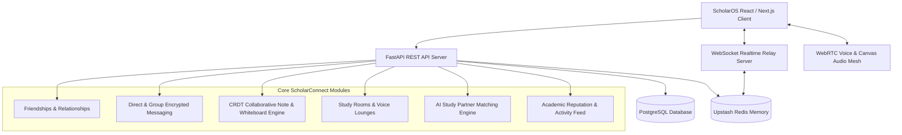

# 🌐 ScholarConnect — AI Academic Collaboration Engine

## Executive Overview
**ScholarConnect** transforms ScholarOS from a solo learning platform into an **AI Academic Operating System & Peer Collaboration Engine**.

This is **NOT a social media network**. There are no clout algorithms, infinite doomscrolling feeds, or vanity metrics. Every feature in ScholarConnect is built with intentional academic utility to help students:
- Connect with verified peers studying similar subjects.
- Collaborate live on notes, whiteboards, flashcards, mindmaps, and assignments.
- Participate in persistent voice study lounges and shared AI tutor sessions.
- Build an academic reputation score based on active peer help, note sharing, and study streak contributions.

---

## 🏗️ System Architecture



---

## 📊 Database Models & Data Schema

### 1. Friendship & Connection Table (`user_connections`)
- `id` (UUID PK)
- `requester_id` (FK -> users.id)
- `addressee_id` (FK -> users.id)
- `status` (`pending`, `accepted`, `declined`, `blocked`)
- `created_at`, `updated_at`

### 2. Connect Rooms / Study Groups (`connect_groups`)
- `id` (UUID PK)
- `name` (String)
- `description` (Text)
- `subject_name` (String)
- `owner_id` (FK -> users.id)
- `is_private` (Boolean)
- `invite_code` (String, Unique)
- `created_at`, `updated_at`

### 3. Group Members & Permissions (`group_members`)
- `id` (UUID PK)
- `group_id` (FK -> connect_groups.id)
- `user_id` (FK -> users.id)
- `role` (`owner`, `admin`, `collaborator`, `viewer`)
- `joined_at`

### 4. Encrypted Realtime Messages (`connect_messages`)
- `id` (UUID PK)
- `channel_id` (String, index: direct pairing or group_id)
- `sender_id` (FK -> users.id)
- `content` (Text - E2EE encrypted payload or markdown)
- `message_type` (`text`, `voice_note`, `shared_note`, `shared_pdf`, `shared_flashcard`, `shared_mindmap`, `shared_quiz`, `shared_tutor_session`)
- `attachment_metadata` (JSON: file_url, note_id, flashcard_deck_id, mindmap_id, quiz_id)
- `is_read` (Boolean)
- `created_at`

### 5. Collaborative Note Sessions (`collaborative_notes`)
- `id` (UUID PK)
- `note_id` (FK -> notes.id)
- `group_id` (Optional FK -> connect_groups.id)
- `yjs_state_vector` (LargeBinary / JSON - CRDT state vector)
- `active_collaborators` (JSON list of online user IDs & cursor positions)
- `created_at`, `updated_at`

### 6. Academic Reputation & Activity Log (`academic_reputation_logs`)
- `id` (UUID PK)
- `user_id` (FK -> users.id)
- `action_type` (`note_shared`, `peer_helped`, `quiz_created`, `study_streak_milestone`, `upvote_received`)
- `points_earned` (Integer)
- `created_at`

---

## ⚡ WebSocket Realtime Protocol Specs (`/api/v1/connect/ws`)

The WebSocket endpoint manages low-latency realtime events:

```json
// Event Types:
// 1. "typing": { "channel_id": "...", "user_id": "...", "is_typing": true }
// 2. "read_receipt": { "channel_id": "...", "message_id": "...", "user_id": "..." }
// 3. "crdt_delta": { "note_id": "...", "delta": "...binary/base64..." }
// 4. "whiteboard_draw": { "room_id": "...", "path": [...] }
// 5. "voice_signal": { "room_id": "...", "signal": {...} }
```

---

## 🤖 AI-Powered Study Partner Recommender Algorithm

The matching engine analyzes:
1. **Academic Field & Year**: Same or complementary course (*e.g., Computer Science Year 2*).
2. **Complementary Skill Matrix**:
   - Matches Student A (*Weak: Data Structures, Strong: Physics*) with Student B (*Strong: Data Structures, Weak: Physics*).
3. **Study Habit Alignment**: Matches active hours and preferred AI teaching language (*English, Tamil, Tanglish*).

---

## 🎨 UI/UX Component Architecture (`ScholarConnect`)

1. **`ConnectShell.tsx`**: Main responsive split view (Sidebar of Channels/Friends + Active Workspace).
2. **`FriendsManager.tsx`**: Add friends by email/tag, pending requests, online presence indicators.
3. **`ChatCanvas.tsx`**: E2EE chat stream, voice note recorder, file dropzone, typing indicators, read receipts.
4. **`SharedArtifactCard.tsx`**: Interactive card preview for shared Notes, PDFs, Flashcards, Mindmaps, and Quizzes with 1-click **Import to My Vault** button!
5. **`CollabEditor.tsx`**: Live real-time co-editing canvas with multi-cursor awareness.
6. **`SharedWhiteboard.tsx`**: Freehand drawing, diagram shapes, text notes canvas for study groups.
7. **`StudyRoomLounge.tsx`**: Virtual WebRTC voice room with screen share and active mic indicators.
8. **`PartnerRecommender.tsx`**: AI study buddy recommendations with 1-click **Send Invite**.
9. **`AcademicFeed.tsx`**: Pure academic progress feed showing peer milestones, shared notes, and study streak badges.

---

## 🔍 Verification & Testing Strategy
- **Backend API Unit Tests**: Test connection endpoints (`/connect/friends`, `/connect/groups`, `/connect/messages`, `/connect/recommendations`).
- **WebSocket Concurrency Tests**: Verify low-latency message broadcast and CRDT state synchronization.
- **Production Build Validation**: Run `npm run build` in Next.js frontend to verify 100% type safety.
